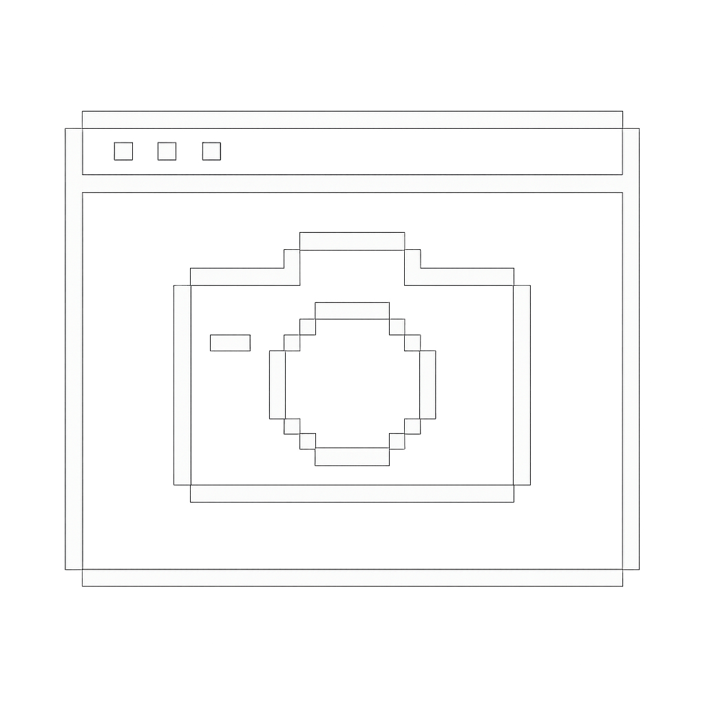

# termicam

<p align="center">
  
</p>

A real-time camera viewer for your terminal. Captures video from your macOS camera and renders it as beautiful Braille patterns with live FPS stats.

## Features

- **Real-time camera capture** - Uses AVFoundation for native macOS camera access
- **Braille rendering** - Each character represents a 2×4 pixel grid for high-resolution terminal graphics
- **Multiple render modes**:
  - Edge detection (gradient-based) - produces sharp, sketch-like output
  - Brightness threshold - simple intensity-based rendering
- **Automatic aspect ratio preservation** - Maintains 1:1 pixel aspect ratio to prevent distortion
- **Performance metrics** - Live FPS, capture time, and conversion time display
- **Terminal-aware** - Automatically adapts to your terminal size

## Requirements

- **macOS** (uses AVFoundation framework)
- **Zig 0.15.1 or later**
- Camera permissions granted to Terminal.app

## Installation

```bash
# Clone the repository
git clone <repository-url>
cd termicam

# Build the project
zig build

# Run
zig build run
```

The executable will be output to `zig-out/bin/termicam`.

## Usage

Simply run the application:

```bash
zig build run
```

Or run the compiled binary directly:

```bash
./zig-out/bin/termicam
```

On first run, macOS will prompt you to grant camera permissions to your terminal application.

Press `Ctrl+C` to exit.

## How It Works

termicam uses a three-stage pipeline:

1. **Camera Capture**: Objective-C++ wrapper around AVFoundation captures frames as grayscale images
2. **Braille Conversion**: Each 2×4 pixel block is analyzed and converted to a Unicode Braille character (U+2800-U+28FF)
3. **Terminal Rendering**: ANSI escape codes clear the screen and display the converted frame

The edge detection mode analyzes gradient strength at each pixel position, creating a sketch-like effect that emphasizes features and boundaries.

## Development

```bash
# Run tests
zig build test

# Build with optimizations
zig build -Doptimize=ReleaseFast

# Clean build artifacts
rm -rf zig-out .zig-cache
```

## Project Structure

```
src/
├── main.zig           - Application entry point and main loop
├── camera.zig         - Zig FFI bindings for camera
├── camera_wrapper.h   - C API header
├── camera_wrapper.mm  - Objective-C++ AVFoundation wrapper
├── ascii.zig          - Braille rendering engine with pluggable modes
├── term.zig           - Terminal utilities (size detection, ANSI codes)
└── root.zig           - Library module root
```

## Technical Details

- Written in **Zig** for systems programming performance
- Uses **Objective-C++** for macOS AVFoundation camera access
- Implements **vtable pattern** for pluggable rendering backends
- Uses **buffered I/O** for efficient terminal rendering
- Unicode **Braille patterns** provide 8× better resolution than ASCII

## Credits

Created with Zig and macOS AVFoundation.
