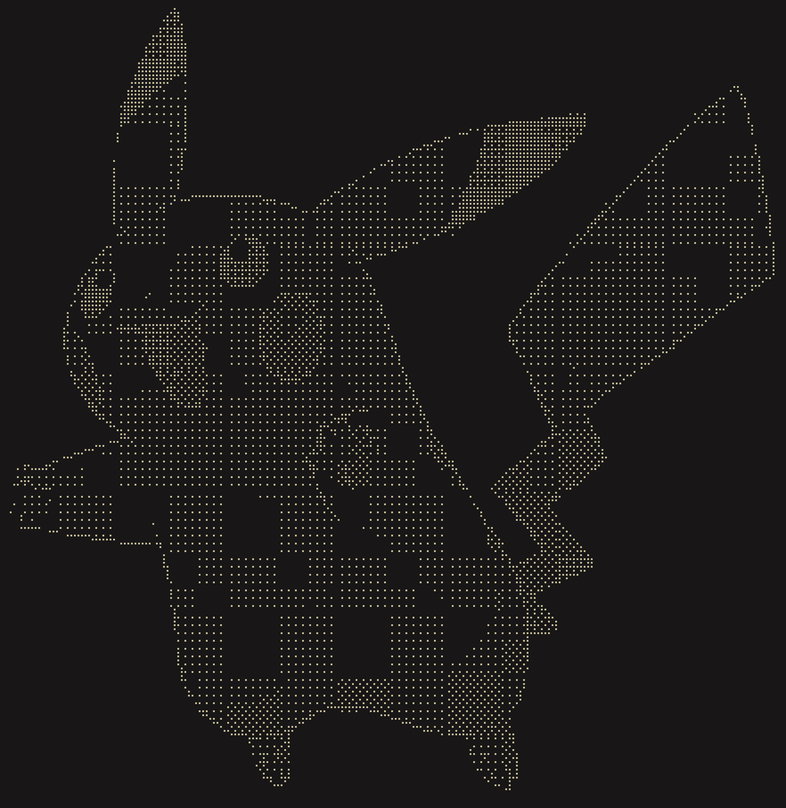

# dith

<p align="center">
  
</p>

Ever wanted to look at yourself... in Braille?

Plug in your webcam or throw any image at it: PNG, JPEG, BMP, whatever. 5 classic dithering algorithms render it live in your terminal.

Built in Zig with native macOS camera integration. No dependencies, just vibes.

## What You Can Do

**Dither anything:**

```bash
# Live camera feed
dith +source=cam +mode=atkinson

# Any image file
dith +source=file +mode=blue_noise +path=photo.png
```

**5 classic dithering algorithms:**

| Mode | Best For |
|------|----------|
| `edge` | Line art, sketches, outlines |
| `atkinson` | High contrast, classic Mac aesthetic |
| `floyd_steinberg` | Photos, smooth gradients |
| `blue_noise` | Organic, film-grain look |
| `bayer` | Retro 8-bit, crosshatch pattern |

**Fine-tune the output:**

```bash
# Adjust sensitivity
dith +source=cam +mode=edge +threshold=50

# Invert colors
dith +source=file +mode=bayer +path=image.jpg +invert
```

## Install

**Requirements:** Zig 0.15.1+, macOS (for camera source)

```bash
git clone https://github.com/user/dith
cd dith
zig build -Doptimize=ReleaseFast
```

Binary is at `./zig-out/bin/dith`. Add it to your PATH or copy it somewhere convenient.

## Usage

```
dith +source=<SOURCE> +mode=<MODE> [options...]
```

### Sources

**Camera** - live feed from your webcam
```bash
dith +source=cam +mode=edge
dith +source=cam +mode=atkinson +warmup=5      # more warmup frames
dith +source=cam +mode=blue_noise +strategy=direct   # no background capture
```

**File** - PNG, JPEG, or BMP
```bash
dith +source=file +mode=floyd_steinberg +path=photo.png
dith +source=file +mode=bayer +path=~/Downloads/image.jpg +invert
```

### Options

| Option | Description | Default |
|--------|-------------|---------|
| `+threshold=N` | Sensitivity 0-255 | varies by mode |
| `+invert` | Flip black/white | off |
| `+warmup=N` | Camera warmup frames | 3 |
| `+strategy=` | `pipelined` or `direct` | pipelined |

## Examples

```bash
# Sketch-like edge detection
dith +source=file +mode=edge +path=drawing.png +threshold=5

# Classic Macintosh dithering
dith +source=file +mode=atkinson +path=photo.jpg

# Smooth photo dithering
dith +source=cam +mode=floyd_steinberg +threshold=140

# Cinematic grain
dith +source=file +mode=blue_noise +path=portrait.png

# Retro game aesthetic
dith +source=cam +mode=bayer +invert
```

## Contributing

```bash
# Run tests
zig build test

# Debug build
zig build

# Release build
zig build -Doptimize=ReleaseFast

# Build and run
zig build run -- +source=cam +mode=edge
```

PRs welcome.
